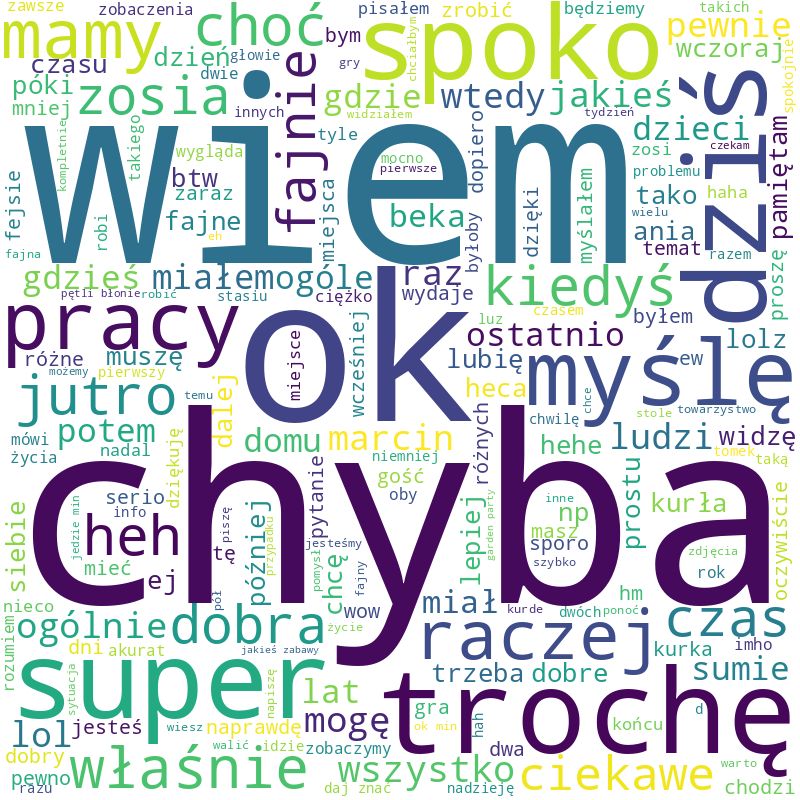

#  Word cloud from Messenger
**Create a word cloud to expose your or your friend’s most common words based on your Messenger history**


 


## General info

This repository contains an easy-to-use program, which let you easily generate a graphic with a word cloud, which displays the most frequently used words or phrases on Messenger by you or your interlocutor.

Generated sample word cloud:

<center> 

</center>

## Technologies
It uses Python with basic libraries, [this word cloud generator](https://amueller.github.io/word_cloud/index.html) and [matplotlib](https://matplotlib.org/stable/index.html) library.

Missing libraries can be installed via:
```
pip install wordcloud
pip install matplotlib
```
or
```
conda install wordcloud
conda install matplotlib
```
Besides, to run [`word-cloud.ipynb`](https://github.com/mowczarz/word-cloud-from-meesenger/blob/main/word-cloud.ipynb) (an alternative to [`word-cloud.py`](https://github.com/mowczarz/word-cloud-from-meesenger/blob/main/word-cloud.py)) you need a program that supports jupyter notebooks.
## Usage
It's really easy.

1. Download the data from your Facebook account ([instruction](https://github.com/mowczarz/word-cloud-from-meesenger/blob/main/data-download-instructions.md)). 

2. Put all unpacked data into the `data` folder.

3. You can put your stopwords (words to be omitted) in the `my-stopwords.txt` file.

4. Launch the program. You'll see the top 10 users with the most messages.

<center> 

</center>

5. Select the user for whom you want to generate a cloud of words. You can do this by entering a place in the list generated above, (e.g. `1`) or by entering any full username, such as `Mark DeVolay`.


That's it, the cloud should be generated and placed in the `word_clouds` folder. I hope you will be satisfied with the effect.

Have fun!
