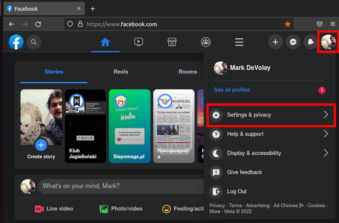
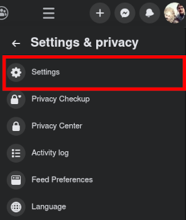
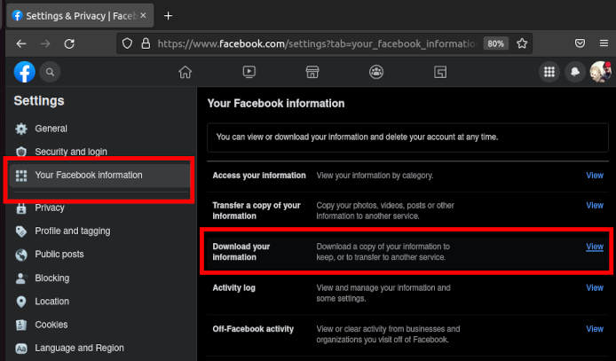
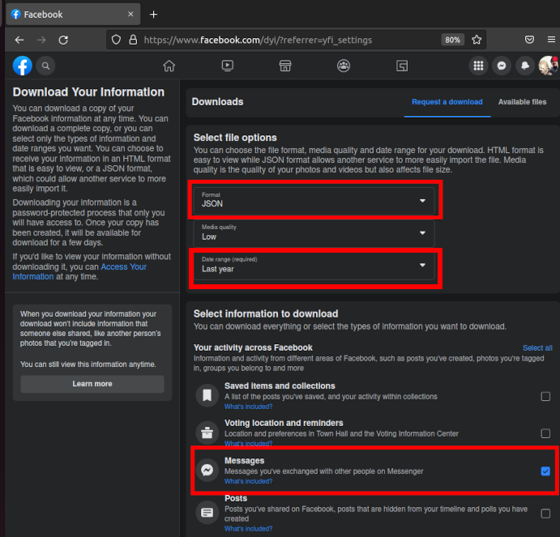
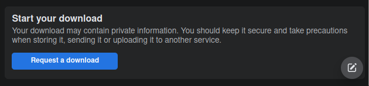
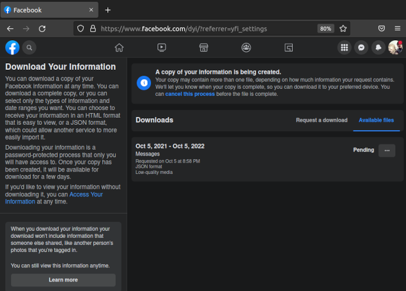
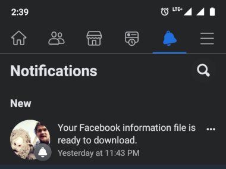
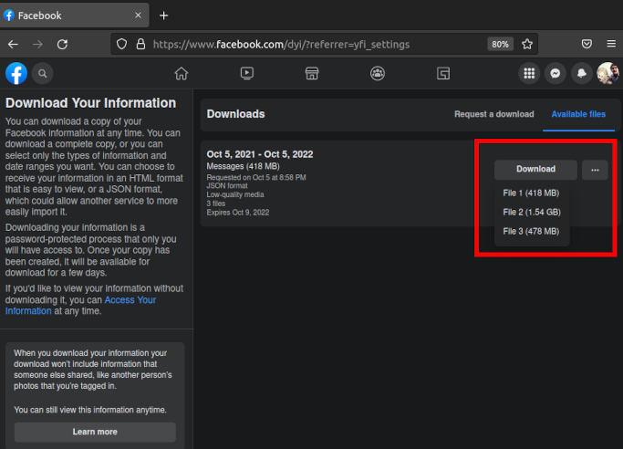
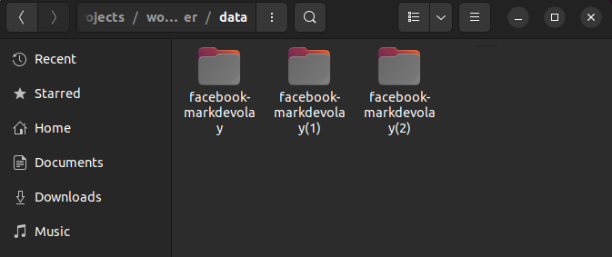

# Data download instructions
1. In the options of your account, select `Settings and privacy`, then `Settings`.

 

 
 

2. In the `Your Facebook information` tab select `Download your information`.

 
 

3. Select the JSON file format, choose the time period you are interested in and select checkbox next to `Messages`.

 
 
At the bottom, click the `Request a download` button
 

 
 

4. Your request has been sent to Facebook. You have to wait about a day for the data to be prepared.

 
 

5. You will receive a notification of data ready for download. You will find them in the same place as before.

 
 
In the same place as before, you can download the data.
 

 
 

6. Unzip the files and put them all in the `data` folder. You don't need to do anything else, the program will search for the necessary files itself.
